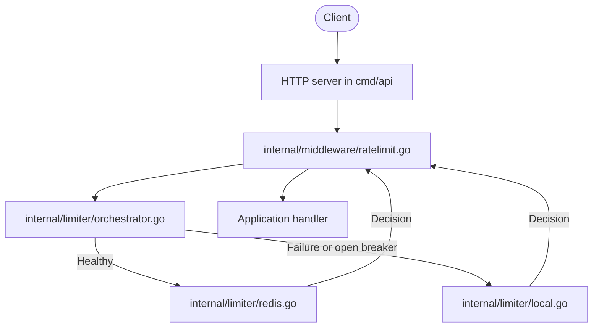
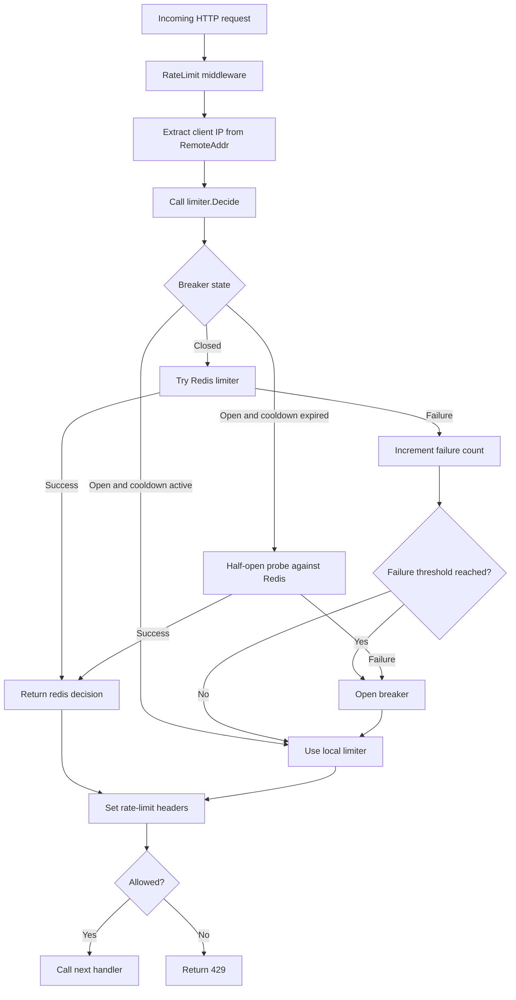

# rate-limiter project guide

This document is a full walkthrough of the project: what it does, how a request moves through the system, what each file is responsible for, and how the Redis path, local fallback, and circuit breaker fit together.

## What this project is

This is a hybrid Go rate limiter. Redis is the primary shared store, an in-memory token bucket is the fallback, and a circuit breaker decides when Redis should be skipped. The goal is not just to rate limit traffic, but to keep doing something sensible when Redis becomes slow or unavailable.

The core behavior is:

1. A request comes in through HTTP middleware.
2. The middleware extracts the client identity from the remote address.
3. The orchestrator first tries Redis.
4. If Redis succeeds, that decision is used.
5. If Redis fails, the request falls back to the local token bucket.
6. After repeated Redis failures, the circuit breaker opens and keeps using the local limiter until the cooldown expires.

## Why this project exists

The project is meant to be a small but realistic learning system. A simple in-memory limiter is easy to build, but it does not help when you need shared state across multiple app instances. A Redis-only limiter is more production-shaped, but it can fail badly if Redis is unhealthy. This code sits in the middle: it shows how to combine both approaches without making the implementation too large to understand.

## High-level architecture



The design has three important layers:

1. The HTTP layer handles requests and responses.
2. The limiter layer decides whether a request is allowed.
3. The Redis/local orchestration layer chooses the best backend at runtime.

## Request flow

The actual request path is simple, but the details matter.

### Step 1: HTTP request enters the server

The example server lives in [cmd/api/main.go](cmd/api/main.go). It creates a Chi router, wires the limiter middleware, and exposes a single `GET /` route that returns `hello`.

### Step 2: Middleware extracts the client key

The middleware in [internal/middleware/ratelimit.go](internal/middleware/ratelimit.go) calls `net.SplitHostPort(r.RemoteAddr)` and uses the IP address as the rate-limit key.

If the remote address is invalid, the request is rejected with `400 Bad Request`.

### Step 3: Middleware asks the limiter for a decision

The middleware calls `Decide(ctx, key)` on the limiter interface from [internal/limiter/limiter.go](internal/limiter/limiter.go).

The returned `Decision` contains:

1. `Allowed`: whether the request may proceed.
2. `Remaining`: how many tokens are left.
3. `RetryAfter`: how long to wait before trying again.
4. `Backend`: which path made the decision, `redis` or `local`.

### Step 4: Orchestrator chooses Redis or local fallback

The orchestrator in [internal/limiter/orchestrator.go](internal/limiter/orchestrator.go) is the control point. It prefers Redis, but it will fall back to the local limiter if Redis fails or if the breaker is open.

The breaker logic is intentionally conservative:

1. Closed: Redis is queried normally.
2. Open: Redis is skipped and the local limiter is used.
3. Half-open: after a 5 second cooldown, Redis gets a probe request.

If Redis succeeds during half-open, the breaker closes again. If it fails, the breaker re-opens and local fallback continues.

### Step 5: Limiter returns a decision

The middleware turns the decision into HTTP response headers:

1. `X-RateLimit-Remaining`
2. `Retry-After`
3. `X-RateLimit-Backend`

If the request is denied, the middleware returns `429 Too Many Requests`. If it is allowed, the next handler runs normally.

## Request flow diagram



## Token bucket behavior

Both Redis and local fallback use a token bucket model.

The model is:

1. Each client has a bucket with a fixed capacity.
2. Requests spend tokens.
3. Tokens refill continuously over time.
4. If there are enough tokens, the request is allowed.
5. If not, the request is rejected and a retry time is returned.

### Redis token bucket

The Redis implementation is in [internal/limiter/redis.go](internal/limiter/redis.go). It uses a Lua script so the refill and spend logic stay atomic in Redis.

The script stores two values in Redis:

1. `tokens`
2. `last_refill`

This path is the shared, cross-instance limiter. It is the correct answer when Redis is healthy.

### Local token bucket

The fallback limiter in [internal/limiter/local.go](internal/limiter/local.go) keeps a per-key bucket in memory.

This path exists so the service keeps behaving predictably if Redis is unavailable. It is faster than Redis, but it is process-local, so it does not coordinate across multiple application instances.

## Circuit breaker behavior

The breaker exists inside [internal/limiter/orchestrator.go](internal/limiter/orchestrator.go).

It is there to avoid repeatedly paying the cost of failed Redis calls. After a small number of consecutive failures, the breaker opens and the orchestrator stops contacting Redis for a cooldown window of 5 seconds.

That means the system chooses availability over strict global coordination during Redis trouble. For this project, that is the intended tradeoff.

## File-by-file guide

### Root files

#### [README.md](README.md)

Main project overview and quick start. It already describes the project at a high level, but this guide goes deeper into the control flow and file responsibilities.

#### [go.mod](go.mod)

Module definition and dependency list. The key external dependencies are Chi for HTTP routing and go-redis for the Redis client.

#### [Makefile](Makefile)

Convenience commands for local development. Use it for repeated tasks like testing or benchmarks instead of typing long commands every time.

#### [LICENSE](LICENSE)

Project license.

### cmd/api

#### [cmd/api/main.go](cmd/api/main.go)

The runnable example HTTP server. It wires together the Redis limiter, local limiter, orchestrator, and middleware, then starts the server on `:8080`.

#### [cmd/api/main_test.go](cmd/api/main_test.go)

Smoke test for the Redis-backed constructor and limiter path. It verifies that a working Redis connection returns a Redis decision.

#### [cmd/api/redis_adapter.go](cmd/api/redis_adapter.go)

A thin adapter that keeps the example server code simple. It forwards constructor arguments into `limiter.NewRedisLimiter` and returns the interface type expected by the rest of the example.

### internal/limiter

#### [internal/limiter/limiter.go](internal/limiter/limiter.go)

Defines the shared contract:

1. `Decision`
2. `Limiter`

Everything else in the package implements or returns that interface.

#### [internal/limiter/redis.go](internal/limiter/redis.go)

Redis-backed token bucket implementation. It contains:

1. `RedisLimiter`
2. `NewRedisLimiter`
3. The Lua token bucket script
4. Result parsing from Redis into `Decision`

This is the shared-state path for the limiter.

#### [internal/limiter/local.go](internal/limiter/local.go)

In-memory fallback limiter. It contains:

1. `TokenBucket`
2. `LocalLimiter`
3. `NewTokenBucket`
4. `NewLocalLimiter`
5. Cleanup logic for stale buckets

This file is responsible for the fallback path when Redis is unhealthy or the breaker is open.

#### [internal/limiter/orchestrator.go](internal/limiter/orchestrator.go)

Circuit breaker and routing logic between Redis and local fallback. It tracks:

1. Failure count
2. Breaker state
3. Last Redis failure time

This is the control plane of the limiter.

#### [internal/limiter/bench_test.go](internal/limiter/bench_test.go)

Benchmarks for limiter hot paths.

#### [internal/limiter/local_test.go](internal/limiter/local_test.go)

Tests for token spending, refill behavior, key separation, and stale bucket cleanup.

#### [internal/limiter/redis_test.go](internal/limiter/redis_test.go)

Tests for Redis response parsing and invalid response handling.

#### [internal/limiter/orchestrator_test.go](internal/limiter/orchestrator_test.go)

Tests for Redis preference, local fallback, breaker opening, half-open retry behavior, and breaker state constants.

### internal/middleware

#### [internal/middleware/ratelimit.go](internal/middleware/ratelimit.go)

HTTP middleware wrapper around the limiter contract. It extracts the client key, calls `Decide`, writes headers, and either forwards the request or returns `429`.

#### [internal/middleware/ratelimit_test.go](internal/middleware/ratelimit_test.go)

Tests for successful requests, rejected requests, invalid remote addresses, and limiter failures.

#### [internal/middleware/bench_test.go](internal/middleware/bench_test.go)

Benchmark for middleware overhead.

### examples

#### [examples/token-bucket.go](examples/token-bucket.go)

Scratch or learning implementation of a token bucket. It is not part of the production path, but it is useful as a simpler reference for understanding the fallback logic.

## How the pieces fit together in practice

If you run the example server, the path looks like this:

1. `cmd/api/main.go` creates the router and the limiter stack.
2. `internal/middleware/ratelimit.go` intercepts each request.
3. `internal/limiter/orchestrator.go` decides whether Redis or local should answer.
4. `internal/limiter/redis.go` uses Redis when available.
5. `internal/limiter/local.go` handles fallback when Redis is unhealthy or the breaker is open.
6. The middleware writes the response headers and either allows the request through or rejects it.

That is the whole loop.

## Configuration values in the example server

The example server currently hard-codes a few demo-friendly values:

1. Redis address: `localhost:6379`
2. Capacity: `10`
3. Refill rate: `2` tokens per second
4. HTTP address: `:8080`

These are good defaults for a local demo, but they should be moved to environment variables if this becomes a real service.

## Testing strategy

Run all tests with:

```bash
go test ./...
```

The test suite is split by concern:

1. Limiter tests verify token bucket mechanics and breaker behavior.
2. Middleware tests verify HTTP behavior and headers.
3. The example server test gives a minimal Redis-backed smoke check.

## Benchmarks

The repository includes benchmarks for the hot paths. They are useful for understanding the relative cost of the main layers:

1. Token bucket math
2. Local fallback decisions
3. Orchestrator behavior
4. Middleware overhead

Run them with:

```bash
make bench
```

## Current limitations

These are the main constraints to keep in mind when reading or extending the project:

1. The local fallback is process-local and does not coordinate across app instances.
2. Client identity comes from `RemoteAddr`, which is fine for the example but incomplete behind proxies.
3. The Redis Lua script and Go code need to stay in sync.
4. Cleanup of local buckets is lazy and best-effort.

## What I would improve next

If you keep building on this project, the highest-value next steps are:

1. Make Redis address, capacity, refill rate, and listen address configurable.
2. Add graceful shutdown to the example server.
3. Add proxy-aware client extraction.
4. Export metrics for request decisions and breaker state.
5. Add integration tests that exercise Redis more realistically in CI.

## Short mental model

If you want the simplest possible summary, it is this:

Redis is the source of truth when healthy. Local memory is the safety net. The orchestrator decides which one to trust. The middleware turns that decision into HTTP behavior.