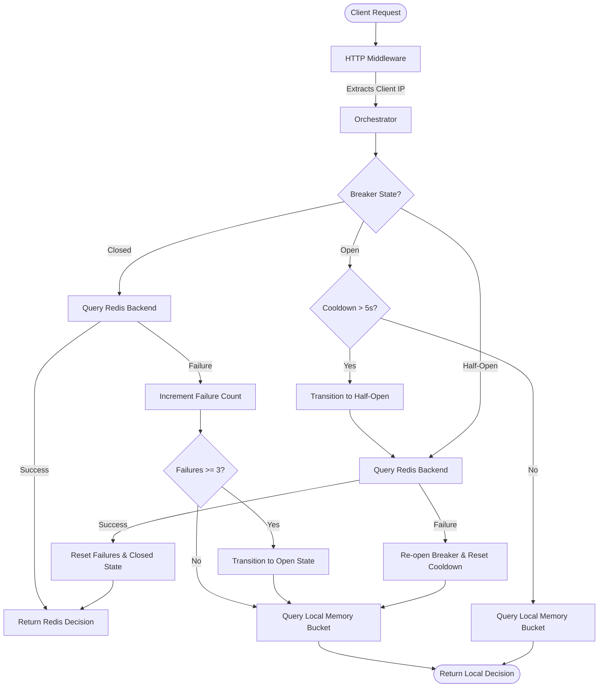
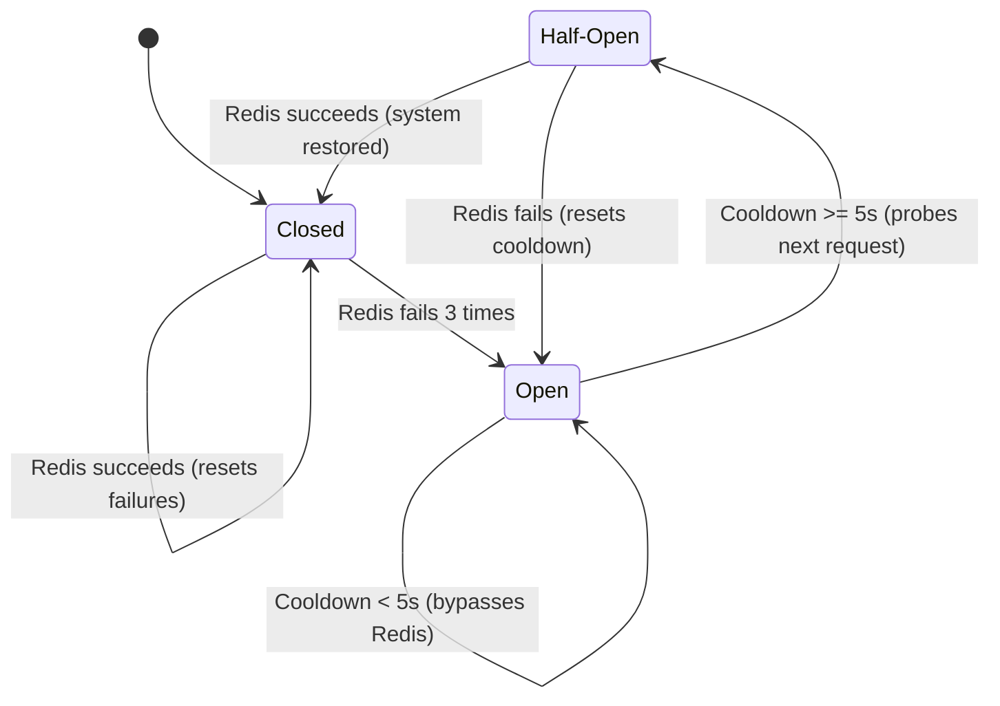

# rate-limiter

[](https://go.dev/)
[](LICENSE)
[](.)

A small Go rate-limiter built to stay useful when Redis is healthy and still behave sensibly when Redis is not. The core idea is a hybrid design: Redis is the primary store, an in-memory token bucket acts as the fallback, and a circuit breaker decides when to stop paying the network tax.

This is not a framework demo. It is a practical learning project that tries to answer the annoying questions that show up in real systems: what happens when Redis blips, where does the fallback live, how do headers get set, and what should the middleware tell callers when they are throttled?

## Features

- Redis-backed token bucket for the fast path.
- In-memory token bucket fallback for resilience.
- Circuit breaker orchestration between the two.
- HTTP middleware that exposes standard rate-limit headers.
- Simple example server under `cmd/api`.
- Tests for limiter behavior, middleware behavior, and the breaker.
- Benchmarks for the hot paths.

## What is a Rate Limiter? (The Layman's Guide)

Before diving into the code, it helps to understand what a rate limiter actually is and why it's a staple of modern web applications.

### The Analogy: The Club Bouncer
Imagine a popular nightclub with a strict capacity limit. If everyone rushed the door all at once, the club would get dangerously overcrowded, the staff would be overwhelmed, and the experience would be ruined for all the guests. 

To prevent this, the club hires a **bouncer** to stand at the entrance. The bouncer's job is to control the rate at which people enter (e.g., allowing at most 5 people in per minute). If you arrive when the limit has been reached, the bouncer tells you to wait.

In web systems, a **Rate Limiter** is that bouncer. It stands in front of your server or API and controls the frequency of incoming traffic.

### Why do we use it?
1. **Preventing Abuse & Denial of Service (DoS):** If a malicious script or bot sends millions of requests to your server in seconds, it can crash your system. A rate limiter stops them early before they consume server resources.
2. **Ensuring Fairness (No Resource Hogging):** If one user runs a heavy script that queries your database constantly, it could slow down the application for everyone else. Rate limiting ensures fair access across all users.
3. **Cost Management:** Many APIs cost money to run (e.g., database queries, third-party AI APIs, email delivery). Limiting requests prevents unexpected cloud bills.
4. **Graceful Degradation:** Instead of crashing under unexpected traffic spikes, the server rejects excess traffic early, keeping the core system healthy.

### The Token Bucket Algorithm (How this project works)
This rate limiter uses the **Token Bucket** algorithm, which is one of the most common and intuitive rate-limiting strategies:
* Imagine a bucket that holds a maximum number of tokens (e.g., 10 tokens).
* Every request a user makes requires taking one token out of the bucket.
* If there are tokens in the bucket, the request is **allowed**, and a token is removed.
* If the bucket is empty, the request is **blocked** (throttled) with an HTTP `429 Too Many Requests` response.
* The bucket constantly refills with tokens at a steady rate (e.g., 2 tokens per second) up to its maximum capacity.

---

## Why this exists

I wanted a rate limiter that was small enough to read in one sitting, but still had the moving parts you would expect in a real service: shared state, fallback behavior, and a bit of failure handling. A lot of sample code stops at `go run`; this one tries to be useful when the network is flaky.

---

## Architecture & How it Works

Most production rate limiters store their token bucket data in a shared cache like **Redis**. This is because multiple copies of your application might be running behind a load balancer, and they all need to share the same record of how many tokens a user has left.

But what happens if **Redis goes down, gets slow, or the network flips**? 
If you rely *only* on Redis, your entire website might crash or hang. 

This project solves that by using a **Hybrid / Resilient Architecture**:
1. **Primary Path (Redis):** The orchestrator checks a shared Redis instance to enforce global limits.
2. **Fallback Path (Local In-Memory):** If Redis fails or becomes slow, the orchestrator bypasses it and falls back to a fast, process-local in-memory token bucket.
3. **Circuit Breaker:** A circuit breaker monitors Redis health. If Redis fails 3 times in a row, the breaker "trips" (opens), immediately routing all traffic to the local fallback without attempting to contact Redis. This protects your application's response times from database network issues.

### Request Flow Diagram

The diagram below illustrates how a request from a client is evaluated by the orchestrator:



### Circuit Breaker States

The circuit breaker moves between three states based on Redis health:



1. **Closed (Healthy System):** Redis is healthy. All rate limiting queries go directly to Redis.
2. **Open (Redis Unhealthy):** Redis is failing. The orchestrator stops calling Redis entirely and routes all traffic to the local in-memory token bucket. This state persists for a **5-second cooldown window** to give Redis time to recover.
3. **Half-Open (Testing System):** Once the 5-second cooldown expires, the next request is sent to Redis as a "probe". 
   - If that probe **succeeds**, the breaker closes, and Redis becomes the primary path again.
   - If that probe **fails**, the breaker immediately re-opens for another 5 seconds, keeping the local fallback active.

## Project structure

```text
cmd/api              Example HTTP server
examples             Scratch/example code used while building the limiter
internal/limiter     Token bucket, Redis limiter, and circuit breaker orchestration
internal/middleware   HTTP middleware that turns limiter decisions into headers
```

## Installation

```bash
git clone https://github.com/SShogun/rate-limiter.git
cd rate-limiter
go mod download
```

If you want to run the Redis-backed path locally, start Redis first:

```bash
docker run -p 6379:6379 redis
```

## Quick start

Run the example server:

```bash
go run ./cmd/api
```

Then hit it a few times:

```bash
curl -i http://localhost:8080/
```

When the limit is hit, the middleware returns `429 Too Many Requests` and includes headers such as:

- `X-RateLimit-Remaining`
- `Retry-After`
- `X-RateLimit-Backend`

## Usage

### Middleware

```go
router := chi.NewRouter()
redisLimiter := limiter.NewRedisLimiter("localhost:6379", 10, 2)
localLimiter := limiter.NewLocalLimiter(10, 2)
orchestrator := limiter.NewOrchestrator(redisLimiter, localLimiter)

router.Use(middleware.RateLimit(orchestrator))
```

### Direct limiter use

```go
dec, err := orchestrator.Decide(context.Background(), "192.168.1.10")
if err != nil {
    return err
}

if !dec.Allowed {
    fmt.Printf("try again in %s\n", dec.RetryAfter)
}
```

## Configuration

The example server is intentionally minimal and currently hard-codes the common demo values:

- Redis address: `localhost:6379`
- Capacity: `10`
- Refill rate: `2` tokens per second
- HTTP listen address: `:8080`

If you turn this into a real service, I would make those values environment-driven first. That is the simplest production improvement with the highest payoff.

## Benchmarks

The repository includes benchmarks for the main hot paths. On my local Windows machine (13th Gen Intel Core i5-13450HX, Go 1.25), the measured results were:

```text
BenchmarkTokenBucketAllowRequest    47.21 ns/op    0 B/op   0 allocs/op
BenchmarkLocalLimiterDecide         159.6 ns/op    0 B/op   0 allocs/op
BenchmarkOrchestratorRedisHit       85.40 ns/op    0 B/op   0 allocs/op
BenchmarkRateLimitMiddleware        1124 ns/op     608 B/op 9 allocs/op
```

The middleware benchmark is naturally a little noisier because it exercises HTTP plumbing and header writes. Redis-backed numbers will move around more in a real deployment, so treat the values above as a local snapshot rather than a promise.

Run them with:

```bash
make bench
```

## Circuit breaker behavior

The breaker is intentionally plain:

- `closed`: Redis is queried normally.
- `open`: Redis is skipped and the local limiter handles requests.
- `half-open`: Redis gets a probe request after the cooldown window.

The implementation is conservative on purpose. It favors serving requests through the local limiter rather than stalling or failing closed whenever Redis is twitchy.

## Limitations

- The local fallback is process-local, so it does not coordinate across multiple app instances.
- Client identity is derived from `RemoteAddr`, which is fine for a demo but not enough behind a proxy without real `X-Forwarded-For` handling.
- The Redis limiter is intentionally small and does not try to solve every distributed-systems edge case.
- Bucket cleanup is lazy and best-effort. That is good enough here, but I would revisit it before putting this in a high-churn multi-tenant service.

## Production recommendations

- Make Redis address, capacity, refill rate, and listen address configurable.
- Add graceful shutdown to `cmd/api`.
- Use trusted proxy parsing if the service sits behind a load balancer.
- Export metrics for limiter decisions, breaker state, and Redis failures.
- Put the Redis path behind an integration test in CI.
- Consider per-route or per-user policies instead of a single global bucket shape.

## Testing

```bash
go test ./...
```

For the race detector:

```bash
go test -race ./...
```

## License

MIT. See [LICENSE](LICENSE).